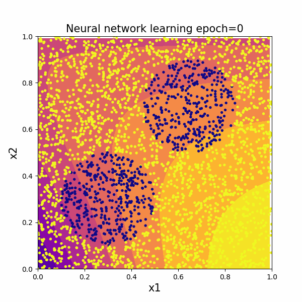
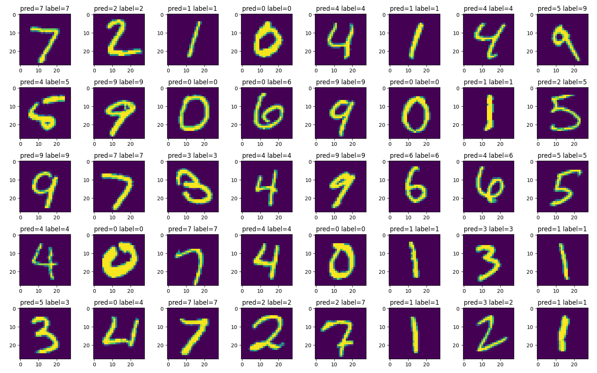
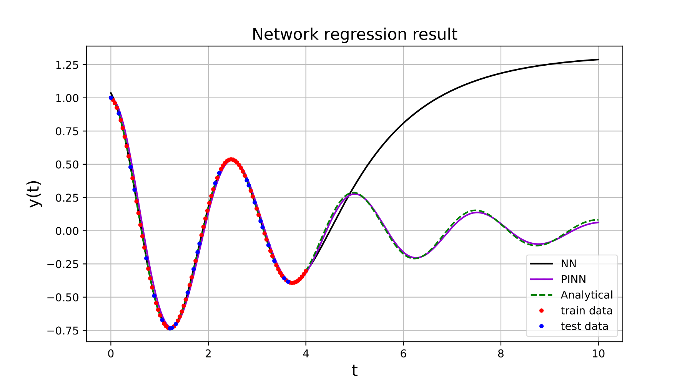

# neural-network
Some code as an introduction to neural networks.

nn_skl.py is a performance comparison of networks using the sklearn library.

Simple\_NN\_classifications.py is a scratch implementation of a simple neural network to distinguish 0 and 1 and see how the network learns.

neural.py is a generalizzation of the above code

data.py build the mnist data so it is possible to read them more easly

mnist.py is a test for neural.py

 

 

