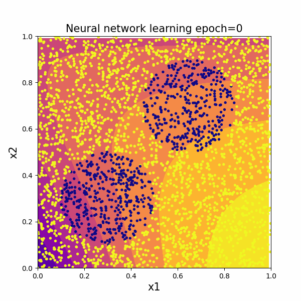

# neural-network
Some code as an introduction to neural networks.

nn_skl.py is a performance comparison of networks using the sklearn library.

Simple\_NN\_classifications.py is a scratch implementation of a simple neural network to distinguish 0 and 1 and see how the network learns.

  
